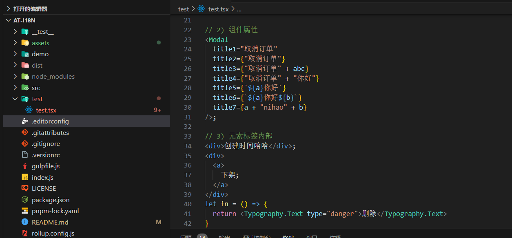
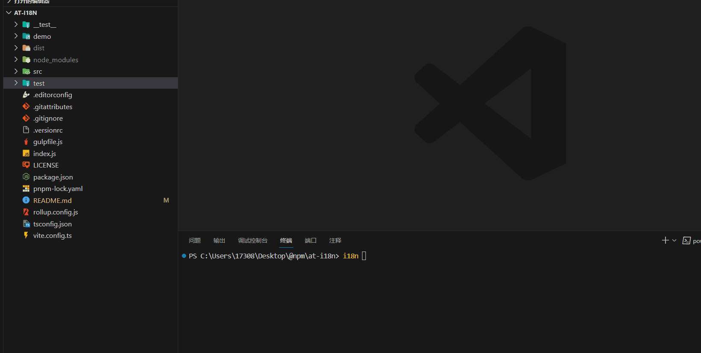
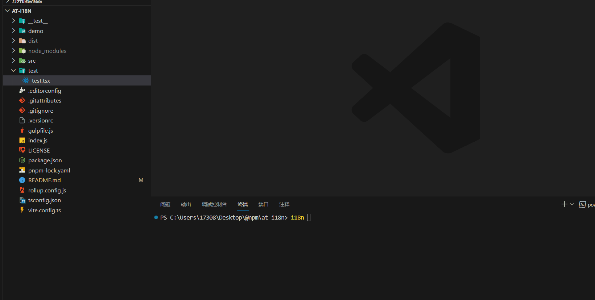

# at-i18n

## ✨ 介绍

这是一个用于提取 tsx 中的中文进行转化的库，如果你的项目是 React 项目，并且没有做国际化翻译，那么使用这个库可以快速帮助你提取中文，并且生成对应的响应变量。

该库包含了大部分的单元测试和快照测试，测试覆盖率百分百，但是仍有部分情况会漏掉，可以提 issue，或者二次开发。

如果生成的响应变量不符合你的需求，可以直接 fork github 仓库，进行二次开发替换成你需要转化的值即可。


## 📦 下载

```bash
npm i -g at-i18n
yarn add -g at-i18n
pnpm add -g at-i18n
```


## 🔨 使用

**测试文件**：



**针对单个文件夹**：



**针对单个文件**：



